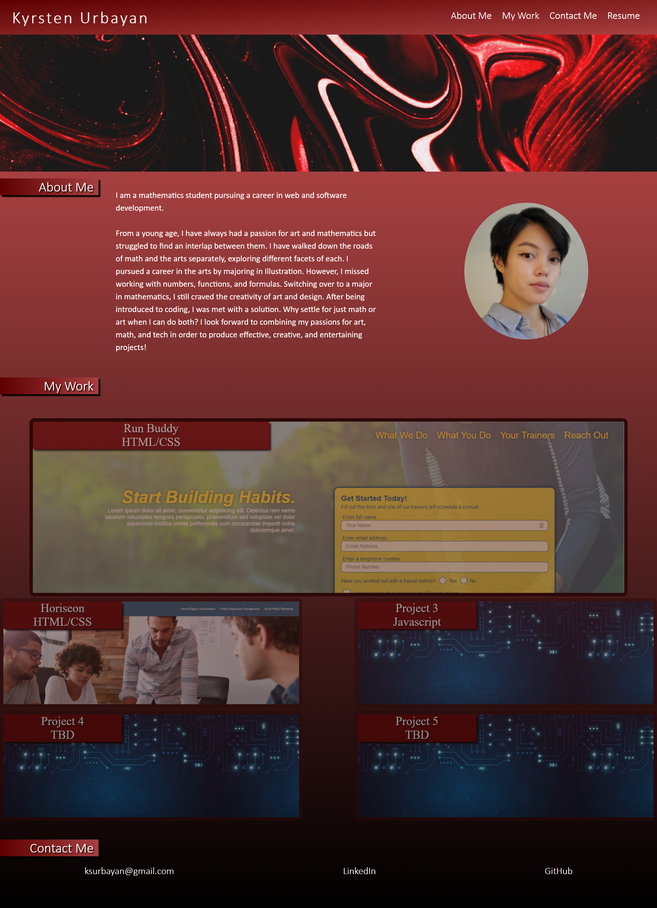

# Kyrsten Urbayan's Portfolio
Portfolio of my work samples for future potential employers to view to determine if I am a good candidate for an open position.

https://kg-phantom.github.io/kyrsten-urbayan-portfolio/

## Header Navigation
There is a navigation menu in the header of the webpage. Clicking on a navigation link will bring the user to the desired section of the page.

## About Me
To give viewers some background information, the "About Me" section briefly describes who I am and what my goals are.

## My Work
The "My Work" section displays screenshot previews of my previous projects. Clicking on a preview brings the user to the deployed project site.

## Contact Me
At the bottom of the portfolio page, there is a section of links to different methods of contact (Email, LinkedIn, and Github).

## Responsiveness
This webpage is also mobile responsive through the use of media queries and flexbox.